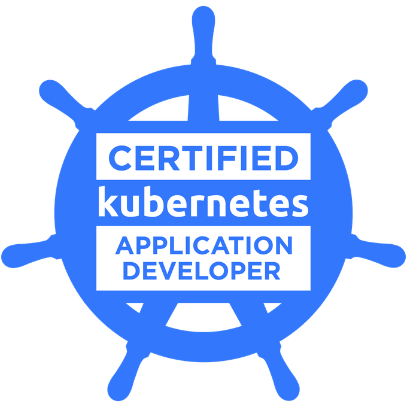
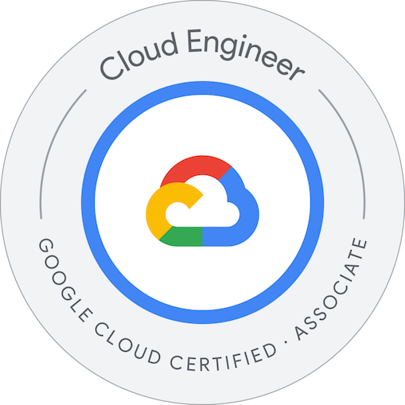

<h2 align="center">Hi there, I'm Nick 👋</h2>

- 😄 My pronouns are hi/him or any
- 📖 Currently reading about local-first software.
- 🔭 Working on an app against procrastination. (https://eatfrogs.com)
- 🌱 Learning about AWS, Kubernetes, Security and all things Cloud and DevOps.
- 👯 Looking to collaborate on projects that have a positive impact on the world.

<hr/>

<h3 align="center">Certifications</h3>

<p align="center" style="display: flex; gap: 10px; flex-wrap: wrap; justify-content: center; align-items: center; text-align: center;">
    <a href="https://www.credly.com/badges/23262c90-5cc3-4c27-bbe3-d85f853f9e7d/public_url" target="_blank">
        
    </a>
    <a href="https://www.credly.com/badges/b503031a-66e4-4226-998c-3591b867aed0/public_url" target="_blank">
        
    </a>
</p>

<hr/>

### More about me...

```typescript
const nick = {
    pronouns: ["he/him", "any"],
    code: ["TypeScript", "Python", "Dart"],
    tools: ["Kubernetes", "Docker", "Terraform", "NestJS", "Flutter"],
    clouds: ["AWS", "GCP"],
    architecture: ["Serverless", "Microservices", "Event-driven", "Domain-driven"],
};
```
